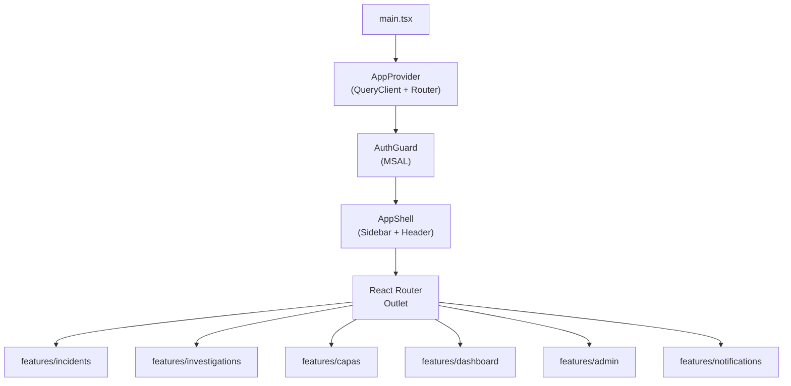

# Lyon Frontend — Phased Build Plan

## Current State

The project has a working Vite + React + TypeScript scaffold with a Herzog-branded landing page. The router, QueryClient, and basic type definitions are in place.

```
src/
  app/         ← provider.tsx, router.tsx
  config/      ← app.ts
  features/landing/   ← LandingRoute + 5 components
  lib/         ← react-query.ts
  types/       ← index.ts (Role, Division)
```

---

## Architecture Overview



---

## Phase 1 — App Shell & Auth

**Goal:** Every other phase builds inside this shell. Nothing else starts until this is done.

### What gets built

- **MSAL integration** — `@azure/msal-browser` + `@azure/msal-react`; `AuthProvider` wraps the app, `AuthGuard` protects all app routes, dev mock-auth fallback for local dev
- **Auth store** — Zustand store exposing `user`, `role`, `division`, `isAuthenticated`
- **`AppShell` layout component** — left sidebar (200px, black, collapsible) with Herzog-brand conventions per `herzog-branding SKILL.md`; sticky header with notification bell placeholder; main content area
- **Sidebar nav links** — Dashboard, Incidents, Investigations, CAPAs, Admin (visibility gated by role)
- **Persistent banner component** — warning amber, dismissible per session, slot reserved in layout
- **Route scaffolding** — all major routes registered in `router.tsx` with lazy-loaded placeholder pages so the nav works end-to-end
- **`ProtectedRoute` wrapper** — redirects unauthenticated users to landing, role-guards specific routes

### Key files

- `src/lib/msal.ts` — MSAL config
- `src/app/AuthProvider.tsx`
- `src/stores/authStore.ts` — Zustand
- `src/components/layouts/AppShell/` — `AppShell.tsx`, `Sidebar.tsx`, `TopBar.tsx`
- `src/components/layouts/PersistentBanner.tsx`
- `src/components/ui/` — `Button`, `Badge`, `Card`, `Spinner` shared primitives

---

## Phase 2 — Incident Reporting

**Goal:** Field Reporters can submit and draft incidents; coordinators can view and search them.

### What gets built

- **Incident list page** — sortable/filterable table (status, division, type, date range); status badges using Herzog semantic colors; clickable rows to detail
- **Quick Report form** — 4 fields: incident type, date/time, location (GPS auto-fill + manual override via modular `LocationPicker`), description; submit creates draft
- **Full Report form** — staged multi-section form; draft auto-save; completion progress bar (red/yellow/green per §3.2)
- **OSHA Recordability wizard** — guided decision-tree UI per §3.3; sets `is_osha_recordable` / `is_dart` flags; override flow with required justification text
- **Railroad notification sub-form** — conditional on "On Railroad Property"; countdown timer display for overdue notifications per §3.4
- **Injured person sub-form** — all fields per §3.5; HIPAA-gated fields hidden for roles without medical access
- **Photo upload panel** — up to 15 photos, 10 MB limit, JPEG/PNG/HEIC, progress indicator
- **Incident detail page** — read-only view of all sections with Recurrence tab placeholder

### New feature folder

```
src/features/incidents/
  components/   ← IncidentTable, QuickReportForm, FullReportForm,
                   OshaWizard, RailroadNotificationForm,
                   InjuredPersonForm, PhotoUpload, CompletionBar
  routes/       ← IncidentListRoute, IncidentDetailRoute,
                   NewIncidentRoute
  api/          ← incidents.ts (TanStack Query hooks)
  types.ts
```

---

## Phase 3 — Investigation Management

**Goal:** Safety Coordinators and Managers can run full 5-Why investigations through to approval.

### What gets built

- **Investigation assignment panel** — assign lead investigator + team; auto-calculated target date per severity (§4.1); overdue escalation badge display
- **5-Why chain builder** — interactive vertical sequence of Why/Answer pairs; min 3 levels; supporting evidence attachments per level; root cause summary field (§4.3)
- **Contributing factor classifier** — checkbox grid grouped by 5 categories (People/Equipment/Environmental/Procedural/Management); primary factor required; per-factor notes; factor types come from admin-configurable library (§4.4)
- **Witness statement form + list** — multi-statement per investigation; immutable after submission (§4.5)
- **Investigation review UI** — Approve / Return for Further Investigation actions for Safety Managers; return requires comment; review cycle history (§4.6)
- **Overdue escalation indicators** — in-page banners matching the 3-tier escalation table in §4.2

### New feature folder

```
src/features/investigations/
  components/   ← InvestigationPanel, FiveWhyBuilder, FiveWhyStep,
                   ContributingFactorForm, WitnessStatementForm,
                   ReviewPanel, OverdueEscalationBanner
  routes/       ← InvestigationDetailRoute
  api/          ← investigations.ts
  types.ts
```

---

## Phase 4 — CAPA Management & Recurrence Linking

**Goal:** Full CAPA lifecycle from creation through effectiveness verification, plus manual incident linking.

### What gets built

- **CAPA creation form** — all fields per §5.1; many-to-many incident linking (multi-select); auto-calculated due dates by priority
- **CAPA list page** — filterable table (status, priority, category, assignee, date range, linked incident); CAPA KPI cards (Open, Overdue, Avg Close Time, Effectiveness Rate) per §5.3
- **CAPA detail page** — status lifecycle stepper (`Open → In Progress → Completed → Verification Pending → Verified Effective/Ineffective`); completion notes + evidence upload; verification form (different user required); "Verified Ineffective" prompt (new CAPA or reopen investigation) per §5.2
- **CAPA aging chart** — distribution by age buckets (Recharts bar chart)
- **Recurrence linking UI** — link two incidents from incident detail Recurrence tab; similarity type multi-select; notes; cluster card view (§6)

### New feature folder

```
src/features/capas/
  components/   ← CapaForm, CapaTable, CapaDetail, CapaStatusStepper,
                   CapaVerificationForm, CapaKpiCards, CapaAgingChart
  routes/       ← CapaListRoute, CapaDetailRoute, NewCapaRoute
  api/          ← capas.ts
  types.ts

src/features/recurrence/
  components/   ← RecurrenceLinkForm, RecurrenceClusterView
```

---

## Phase 5 — Safety Dashboard

**Goal:** Executives, managers, and coordinators get live TRIR/DART metrics and trend charts.

### What gets built

- **KPI cards row** — TRIR, DART Rate, Near Miss Ratio, Open Investigations, Open CAPAs, Lost Work Days YTD; trend arrows vs. prior period (§7.1)
- **Incident trend chart** — 12-month rolling stacked bar by incident type (Recharts)
- **TRIR trend chart** — monthly line chart with configurable industry benchmark line
- **Incidents by division** — grouped bar chart
- **Severity distribution** — donut chart
- **Leading indicators cards** — Near Miss Reporting Rate, CAPA Closure Rate, Investigation Timeliness; target vs. actual with on-track/behind indicator (§7.3)
- **Recent incidents table** — last 10 incidents, clickable rows (§7.4)
- **Dashboard filter bar** — date range, division, project, incident type; all charts respond (§7.6)
- **Hours worked entry** — modal/drawer for Safety Managers; company-wide + per-division; validation gate for TRIR/DART display (§7.5)

### New feature folder

```
src/features/dashboard/
  components/   ← KpiCards, IncidentTrendChart, TrirTrendChart,
                   DivisionChart, SeverityDonut, LeadingIndicators,
                   RecentIncidentsTable, DashboardFilters,
                   HoursWorkedForm
  routes/       ← DashboardRoute
  api/          ← dashboard.ts
```

---

## Phase 6 — Notifications, PDF Trigger & Admin

**Goal:** Complete the platform with the notification system, PDF export, and all admin configuration surfaces.

### What gets built

- **Notification bell + inbox drawer** — unread badge, panel with icon/title/summary/timestamp, click-through, mark-read, 90-day history (§8.1)
- **Persistent banner** — slots into `AppShell`; warning amber; session-collapsible; driven by notification store (§8.2)
- **PDF generation trigger** — "Generate Report" button on incident detail; calls server endpoint; audit-logged; medical redaction per viewer role (§9)
- **Admin pages:**
  - Railroad rules (CRUD: railroads + notification deadline rules per incident type)
  - Shift window definitions
  - Contributing factor type library (categories + factors, add/edit/deactivate)
  - Hours worked entry (promoted from dashboard to admin)
  - Railroad property geofence management (radius zones)
  - User management (list users, assign roles + divisions)
- **Audit log viewer** — Admin-only; searchable by entity, user, date range, action type; append-only table (§11)

### New feature folders

```
src/features/notifications/
  components/   ← NotificationBell, NotificationDrawer,
                   NotificationItem
  stores/       ← notificationStore.ts
  api/          ← notifications.ts

src/features/admin/
  components/   ← RailroadRulesForm, ShiftWindowForm,
                   FactorTypeLibrary, GeofenceManager,
                   UserManagementTable
  routes/       ← AdminLayout, AdminRailroadsRoute, AdminFactorsRoute,
                   AdminUsersRoute, AdminAuditLogRoute
  api/          ← admin.ts
```

---

## Shared Infrastructure (built incrementally, starting Phase 1)

- `src/components/ui/` — Button, Badge, Card, Spinner, Modal, Drawer, Table, Stepper, ProgressBar, Tooltip, FormField
- `src/hooks/` — `useAuth`, `usePermission`, `useDivisionScope`, `useDebounce`
- `src/utils/` — `formatDate`, `formatTrir`, `cn` (clsx wrapper)
- `src/types/` — expand `index.ts` with entity types as each phase lands

---

## Dependency additions needed before Phase 1

- `@azure/msal-browser` + `@azure/msal-react` — Azure AD SSO
- `zustand` — auth + notification stores
- `recharts` — charts (Phase 5)
- `react-hook-form` + `zod` — form handling and validation (Phase 2+)
- `@tanstack/react-query` already installed
